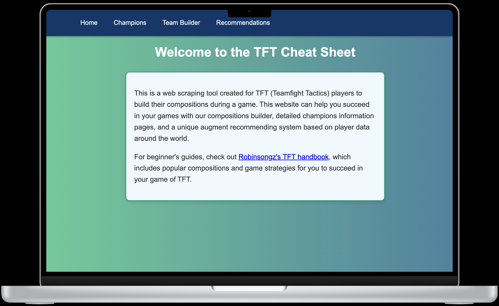

# Instructions
Please run this project using the 'python app.py' command.

# Description

This project is designed to create in-game recommendations for building a composition of teams in the game Teamfight Tactics. By allowing players to choose their available champions and items, the website will recommend the best composition, based on win rates, using online data websites https://tactics.tools/. This website includes all the raw data on how to pick augments (to strengthen your chess board), which will be used in analyzing the best strategy to win the game. This project will include several features:
- Allowing user to input their current inventory of items and champions (as in chess)
- Providing recommendations of what items or augments to select based on data from the online data website
- Providing pre-game strategies for the highest-winrate compositions, as well as the strategy to build them
- Building an API to automate data query from the data website
- Change the recommendations based on real-time game progressions
- Providing step-by-step instructions to manage player’s economy

# Tools
SQLite3
Flask API
BS4